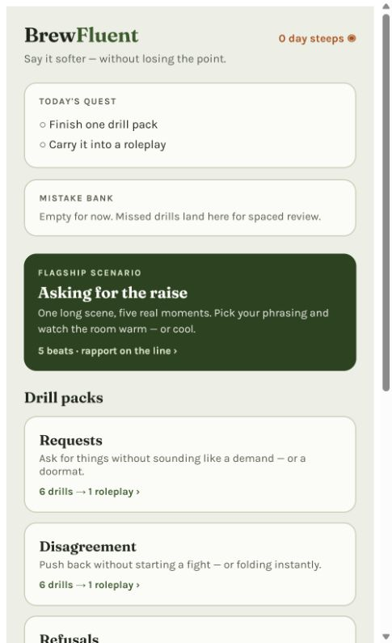

# BrewFluent

**Workplace English tone practice for people who already know the words.**

BrewFluent is a React prototype for English pragmatics: the small phrases that
make a request sound reasonable, a disagreement sound constructive, or a refusal
sound firm without being rude.

Learners drill a softener, carry it into a roleplay, and bank anything they miss
for spaced review. The Steep Gauge keeps the target visible: under-brewed is too
blunt, over-steeped is too hedged, and the middle is clear but considerate.



## What Works Now

- Five authored drill packs: Requests, Disagreement, Refusals, Feedback, and
  Closers.
- Tap-to-choose and free-text rewrite drills.
- Drill-to-roleplay transfer, where missed or newly learned patterns become
  targets in a short conversation.
- A spaced mistake bank with interval-doubling review.
- Daily quest and streak state.
- A new-tab-style "Softener of the Day" surface.
- Pressure Mode for faster, less patient roleplay practice.
- One hand-built branching scenario, "Asking for the Raise," with rapport and
  multiple endings.
- Local fallbacks for rewrite scoring and roleplay turns, so the interface can
  still be inspected without live model access.

## Product Loop

```text
Drill -> Transfer -> Roleplay -> Bank -> Review
```

BrewFluent is for advanced English learners who can form correct sentences but
still get tripped up by tone. It does not start with grammar. It teaches the
social layer around grammar: when to soften, when to stay direct, and how to
avoid apologizing so much that the point disappears.

## Tech Stack

- Vite
- React
- TypeScript-flavored TSX
- Anthropic Messages API integration for live rewrite scoring and NPC roleplay
- Browser storage for prototype state
- Inline design tokens using Fraunces, Karla, leaf, copper, mist, and warm paper
  tones

The prototype can run without model access because the scoring and roleplay
paths include local fallbacks. A real deployment should move model requests
behind a backend route and keep secrets server-side.

## Run Locally

```bash
npm install
npm run dev
```

Then open `http://127.0.0.1:5173`.

Build the production bundle with:

```bash
npm run build
```

## Repository Layout

```text
.
+-- index.html
+-- package.json
+-- README.md
+-- LICENSE
+-- docs/
|   +-- architecture.md
|   +-- assets/
|   |   +-- brewfluent-home.png
|   +-- plan-addendum-solo-rescope.md
+-- src/
    +-- BrewFluent.tsx
    +-- main.jsx
```

`src/BrewFluent.tsx` holds the prototype UI, authored content, scoring prompts,
roleplay flow, review scheduling, and scenario logic. `docs/architecture.md`
captures the product loop and implementation notes.

## Testing

There is no automated test runner yet. Current checks are:

- `npm run build`
- Run through each drill pack.
- Submit at least one rewrite with and without model access.
- Complete a roleplay and confirm missed targets enter the mistake bank.
- Review a banked item and confirm the interval changes.
- Open the widget surface and try its mini drill.
- Complete the branching scenario at different rapport levels.

## Deployment Notes

Before this becomes a production web app:

- Put model calls behind a server route.
- Replace prototype storage with durable user data.
- Add tests around target matching, mistake-bank scheduling, and scenario
  branching.
- Add authentication only after the core learning loop is stable.

## Roadmap

- Add the backend route for model calls.
- Expand authored packs and review prompts.
- Add speech-scored drills through an external speech assessment API.
- Turn the hand-built branching scenario into private authoring tools if usage
  data supports it.
- Defer marketplaces, native shells, public user-generated content, and social
  competition until the product has real users.

## License

Proprietary. Copyright (c) 2026 I-Kai Huang. All rights reserved.

This repository is public for reference only. No rights to use, copy, modify, or
redistribute the code or content are granted beyond what is stated in
[`LICENSE`](LICENSE).
